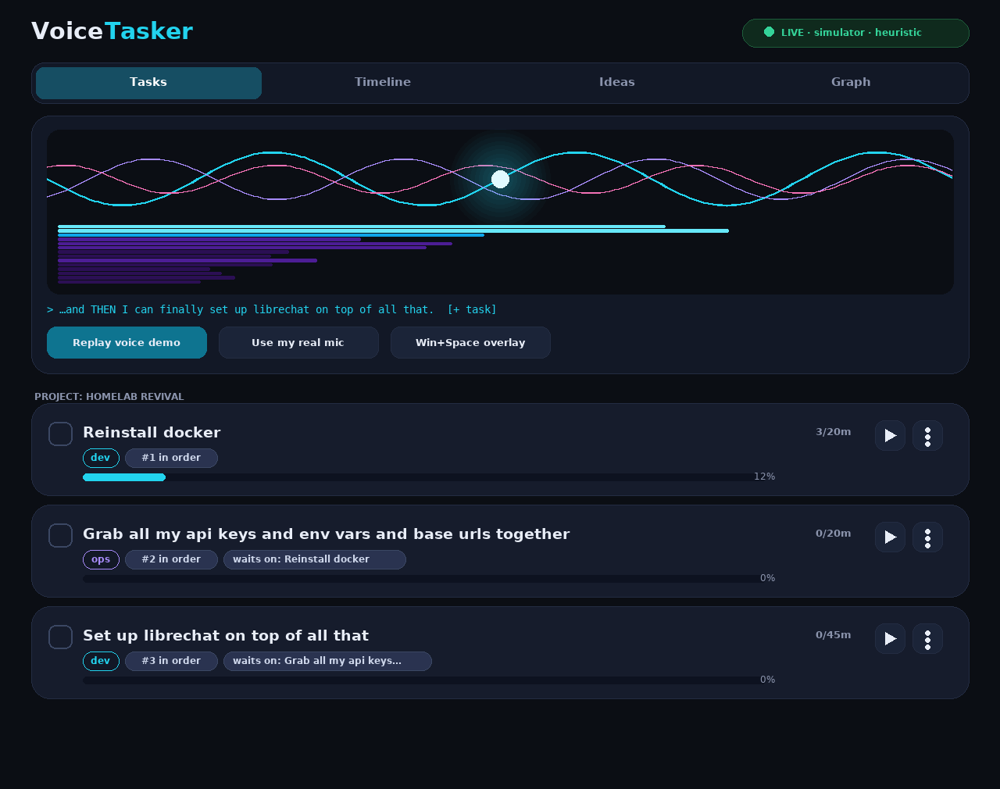
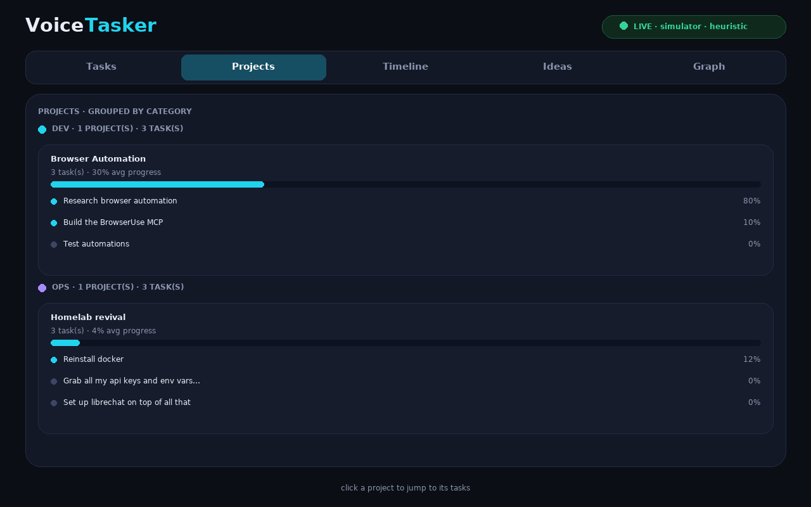
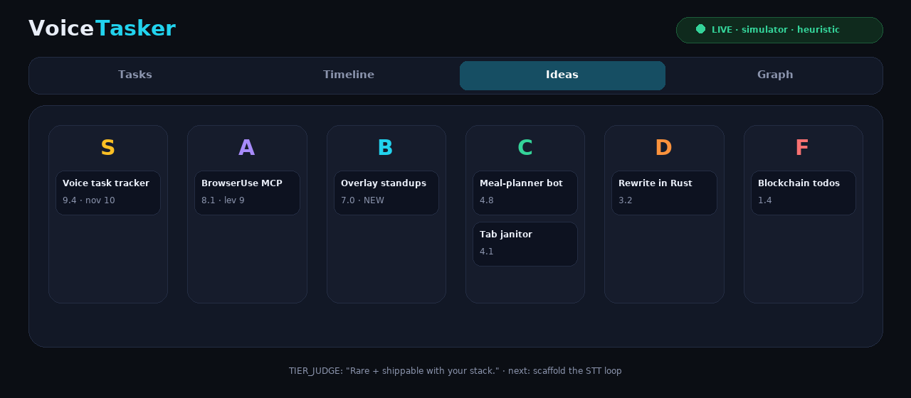
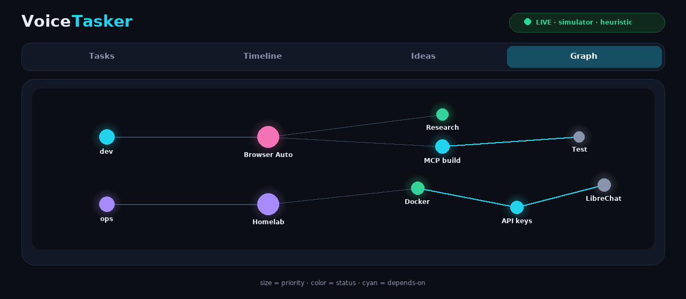

# ADHD-Voice-Tasker 🎙️✅

**Talk out loud. Get organized.** A voice-first task tracker for brains that
have 47 tabs open — literally and mentally.

Speak about what you're working on → streaming STT → an ultra-fast LLM loop
extracts **tasks, projects, categories, priorities, dependencies, and ideas**
in ~1 second, rendered as huge blocky cards with a live voice visualizer.



## ✨ Features

| | |
|---|---|
| 🎤 **Voice in** | Deepgram Nova-3 streaming STT (sub-300ms partials) + offline simulator |
| ⚡ **Fast loop** | Cerebras / Groq / LLM Gateway (DevPass) router — LLM-first, heuristic fallback, zero keys needed for demo |
| 🧱 **Tasks** | Huge rounded cards with category pills, `#n in order` + `⛓ waits on` dep badges, time bars, ▶ timers |
| 📁 **Projects** | Tasks grouped by category → project, avg progress bars, click-through |
| 🏆 **Ideas** | LangChain judge ranks every idea **S-tier → F-tier** with verdicts |
| 🕸️ **Graph** | Live knowledge graph: category → project → task + dependency edges |
| 🌊 **Visualizers** | Terminal sine-wave + spectrogram TUI *and* a 60fps canvas React module |
| ⌨️ **Overlay** | Win+Space quick-capture bar (spec'd, Tauri shell in Phase 2) |
| 🤖 **Dispatch** | Send any task to Hermes Agent or Claude Code → session link on the card |
| 🔔 **Nudges** | Windows toasts for forgotten tasks ("Still on this?") |





## 🚀 Quickstart

```bash
git clone https://github.com/kyl-er/ADHD-Voice-Tasker.git
cd ADHD-Voice-Tasker

python setup_wizard.py        # interactive setup: keys, defaults, .env, DB
pip install -r requirements.txt
python -m uvicorn src.api.server:app --port 8765   # backend + UI at /
```

No keys yet? No problem — the app runs fully offline with the
**simulator + heuristic extractor**, and the UI auto-plays a voice session
on first load. Add keys later via the wizard to go live:

| Key | Where | Used for |
|---|---|---|
| `DEEPGRAM_API_KEY` | https://console.deepgram.com ($200 free) | Streaming STT |
| `CEREBRAS_API_KEY` | https://cloud.cerebras.ai | Hot loop (~1800 tok/s) |
| `GROQ_API_KEY` | https://console.groq.com | Realtime turns (<100ms TTFT) |
| `LLM_GATEWAY_API_KEY` | https://llmgateway.io (`llmgtwy_…`) | 200+ models, one endpoint |

```bash
python setup_wizard.py --check   # validate .env
python setup_wizard.py --test    # validate + ping each provider
python -m src.tui.visualizer --demo   # TUI sine/spectrogram (no mic needed)
python -m pytest tests/ -q       # 10 tests
```

## 🧠 How it works

```
mic → VAD → Deepgram streaming → fast LLM (extract/categorize/dedup)
        → smart LLM (deps DAG, clustering, S–F tiers) → SQLite + WebSocket fan-out
        → Tasks / Projects / Timeline / Ideas / Graph · toasts · agent dispatch
```

Say *"first reinstall docker, then grab the api keys, and finally set up
librechat"* → the pipeline builds a chained, project-grouped plan:

```
#1 Reinstall docker ──→ #2 Grab api keys… ──→ #3 Set up LibreChat   [Homelab revival]
```

Full design: **[ARCHITECTURE.md](ARCHITECTURE.md)** · build plan:
**[ROADMAP.md](ROADMAP.md)** · overlay spec + UI mockups in **`docs/`**.

## 📁 Repo map

```
├── setup_wizard.py        # CLI installer (start here)
├── demo.html              # the UI (served by the backend at /)
├── screenshots/           # rendered mockups + PIL generator
├── src/
│   ├── config.py          # typed .env loader + validation
│   ├── providers/         # deepgram / cerebras / groq / gateway + router
│   ├── voice/             # pipeline + offline heuristic extractor + simulator
│   ├── tasks/             # models, sqlite store, deps DAG, ranker
│   ├── ideas/             # LangChain S–F tier evaluator (+ heuristic)
│   ├── notifications/     # Windows toast nudges
│   ├── dispatch/          # Hermes + Claude Code SEND TO PROCESS
│   ├── tui/               # Textual-style sine + spectrogram visualizer
│   ├── api/               # FastAPI + WebSocket fan-out
│   └── activity/          # Phase-4 ambient tracking (spec'd, not built)
├── ui/web/                # <VoiceVisualizer/> React module (canvas, 60fps)
└── tests/                 # 10 passing
```

## 🗺️ Status

- ✅ **Phase 0** — design + foundation + wizard
- ✅ **Phase 1** — live voice→task loop (simulator+heuristic, API+WS, wired UI)
- 🔜 **Phase 2** — Timeline/Ideas/Graph as live views, Tauri overlay, toasts
- 🔜 **Phase 3** — agent dispatch + smart-pass resolver
- 📋 **Phase 4** — ambient activity tracking (designed, not started)
